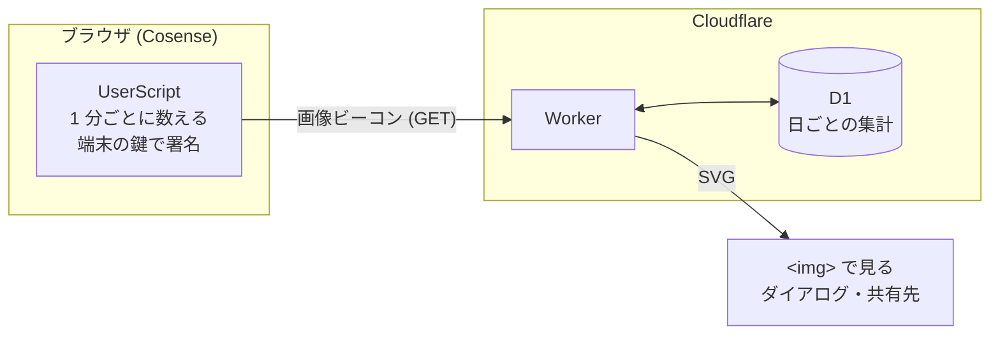

# cosense-grass

Cosense (旧 Scrapbox) での活動を、GitHub のコントリビューショングラフのような 1 年分の「草」にする。

**書いた時間だけでなく読んだ時間も数え**、日ごとの量を色の濃さ、読み書きの比を色合いで表す。
草は画像の URL で共有できるので、Cosense のページにもそのまま貼れる。

<!-- readme-image: demo-grass -->


- 本番: <https://grass.soui.dev> ([日本語](https://grass.soui.dev/ja))
- 配布: Cosense の公開プロジェクト [/cosense-grass](https://scrapbox.io/cosense-grass/)

Cosense の公式サービスではない。運営元の株式会社 Helpfeel とは関係のない、個人のプロジェクト。

## 何を数えるか

**1 分を 1 マスとして、書いた分と読んだ分を数える。** 同じ分に両方あれば「書いた」にする。

<!-- readme-image: guide-minutes -->


- **書いた**: 自分がページを編集した分。他の人の編集と undo / redo は数えない
- **読んだ**: ページが見えていてフォーカスがあり、最後の操作 (スクロール・マウス・キー) から 3 分以内の分。
  設定で「読んだ時間も数える」を切れば数えない
- 数えるのは、自分のユーザーページに import の 1 行を書いたプロジェクトだけ

## 草の読み方

**1 マスが 1 日、1 列が 1 週間。** 濃さが量、色合いが読み書きの比率を表す。

<!-- readme-image: guide-grass -->


- 濃さは、自分の全期間の分布の四分位で 4 段に分ける (他の人とは比べない)
- 色合いは、**自分のふだんの比率**を青緑にして、読み寄りなら紫、書き寄りなら琥珀に振れる (色覚に配慮した配色。ADR-0023)
- 合計が 3 分未満の日は色を付けない

## 活動の概観

書いた分を「どのページに書いたか」で 3 つに分け、読んだ分と並べて 4 軸のレーダーにする。

<!-- readme-image: demo-overview -->


<!-- readme-image: guide-overview -->


| 軸 | 数えるもの |
|---|---|
| 作る | その日に自分が作ったページに書いた分 |
| 育てる | 自分が前に作ったページに書いた分 |
| 関わる | 他の人が作ったページに書いた分 |
| 読む | 読んだ分 |

ページの作成者と作成日はブラウザの中で Cosense に問い合わせて振り分ける。サーバに送るのは分数だけ。

## 使い方

### 1. 1 行書く

Cosense の自分のユーザーページ (`/{project}/{username}`) に書く。

```
code:script.js
 import "/api/code/cosense-grass/v1/script.js"
```

外部ドメインからの import は Cosense の UserScript の仕組み上できないので、配布は公開プロジェクト経由にしている (ADR-0005)。
`dev` は開発版なので import しない。

**記録は書いた日から始まる。** 過去の活動は遡らない (ADR-0012)。

**この 1 行を書いたページに、カードの図の行が自動で書き込まれる** (ADR-0025)。サインインして端末を登録すると、
UserScript がそのページの読み込みのコードの下に、そのプロジェクトのカード (曜日 × 時間帯の草と活動の割合の図) を 1 行貼る。

- **消しても、次にそのプロジェクトを開いたときに貼り直される**。動かした行はそのまま
- 止めるには、自分のユーザーページから import の 1 行を外す (カードだけを止める設定は無い)
- 書き込みはブラウザから自分の Cosense のアカウントで行い、サーバは経由しない。自動で貼った行は「書いた」に数えない

### 2. Google でサインインする

ページメニューに「cosense-grass」が 1 つ増える。そのダイアログの「設定」から **Google でサインイン**して、この端末を登録する。
**草を描くのはサーバなので、登録するまで草は出ない** (数えるのは登録前から始まっていて、登録すると直近 30 日分を送る)。

サインインは端末を増やすときだけで、草を見るのには要らない。受け取るのは Google アカウントの識別子だけ (`openid` スコープ)。

### 3. ダイアログで見る

- 「全端末を統合した記録」として、**合算 → 今のプロジェクト → ほかのプロジェクト**の順に草と活動の概観が並ぶ
- 「期間」で過去の年を選べる
- 「共有する」から、草・活動の概観・日ごとの数値 (JSON) の URL と、カードを Cosense に貼る行をコピーできる
- まだ送っていない記録があるかと「今すぐ送る」ボタン
- 「草と活動の概観の見方」に、この README と同じ図の説明がある

**複数の端末で使う**ときは、それぞれで同じ Google アカウントでサインインするだけ。鍵のコピーも復旧コードも要らない。
端末ごとに別の鍵ペアが作られ、同じ草に記録される。全端末を失ってもサインインし直せば元の草に戻る。

**複数のプロジェクトで使う**ときは、各プロジェクトの自分のユーザーページに同じ 1 行を書く。
Cosense は自分のユーザーページの `code:script.js` しか読まないため。記録したくないプロジェクトには書かなければよい。

### 4. 草を貼る

ダイアログからコピーした URL を、Cosense では単体の角括弧で貼る (二重角括弧はクエリ付きの URL を画像にしない)。

```
[https://grass.soui.dev/v1/g/<publicId>.svg?l=<プロジェクト名>&u=<ユーザー名>]
```

| 共有するもの | URL |
|---|---|
| 草 | `/v1/g/{publicId}.svg` |
| 活動の概観 | `/v1/g/{publicId}/overview.svg` |
| 日ごとの数値 (JSON) | `/v1/g/{publicId}/{dataKey}.json` |

- 合算とプロジェクト別で別々の `publicId` が発行される。プロジェクト別の URL を渡しても、合算やほかのプロジェクトは見えない
- **共有 URL は第三者には計算できない**ので、貼るまで誰にも見られない。JSON の `dataKey` は草の URL からは作れない
- `?l=` はプロジェクト名、`?u=` は `@ユーザー名` を画像に描く。サーバはどちらも保存しない。見せたくなければ URL から削る

画像はクエリで見た目を変えられる。不正な値は既定に戻る。

| パラメータ | 値 | 既定 |
|---|---|---|
| `theme` | `light` / `dark` | `light` |
| `weeks` | 1〜53 | 53 |
| `year` | 4 桁の年 (その年の 12/31 が右端) | 直近 |
| `mode` | `bi` (読み書き) / `write` (書きだけの単色)。草だけ | `bi` |

### 5. 管理のページ

<https://grass.soui.dev/account> で、登録した端末の一覧と失効、合算の共有 URL、全データの削除ができる。
Cosense の「設定」でできるのは、そのブラウザでしかできないこと (この端末の登録取り消し、読みを数えるかの切り替え、このブラウザの記録を消す) だけ (ADR-0018)。

### 草の更新は少し遅れる

無料枠で運用するため、送るのはページを開いたとき・日付が変わったとき・タブを離れたときに限っている (ADR-0010)。
共有画像にも最大 15 分のキャッシュがある。急ぐときはダイアログの「今すぐ送る」で送れるが、**普段は押す必要はない**。

## 仕組み



- **UserScript** は数えて送るだけで、草は描かない (ADR-0019)
- **Cloudflare Worker + D1** が記録を受け、草・概観を SVG で描く。Worker は作者が 1 つホストして公開提供していて、利用者は何もデプロイしない
- Cosense の Content-Security-Policy が外部への `fetch` と `sendBeacon` を塞いでいるので、**送信は画像の GET リクエスト**で行い、
  日ごとのビットマップを毎回全量送ってサーバで OR する (ADR-0001、ADR-0002)。受信の経路も無いので、草は `` で見る

## サーバに何が渡るか

**秘密鍵は端末から出ない。** 端末ごとに鍵ペアを作り、送信のたびに署名する。
サーバにもログにも秘密鍵は届かないので、**運営者でも利用者の草に書き込めない。**

| 保存するもの | 形 |
|---|---|
| 利用者の識別子 | Google の `sub` を Worker 固有の秘密で HMAC した値。`sub` そのものは保存しない |
| 端末の公開鍵 | 署名の検証に使う |
| プロジェクトの識別子 | 利用者の識別子でソルトしたハッシュ。**記録にプロジェクト名は載せない** |
| 日ごとの活動量 | 書いた分・読んだ分と概観の内訳、編集・作成したページ数、リンク数 |
| 分単位のビットマップ | どの分に活動したか。**90 日で消す**作業データ |
| タイムゾーン | 日付の区切りに使う |

メールアドレスも氏名も保存しない。**どのページを読んだかも記録しない** — 読んだ記録にページの識別子を一切載せていない。

**日ごとの集計値は期限で消さない** (数年後に振り返れるように)。管理のページから全データを削除すると消える。
詳細は [プライバシーポリシー](docs/privacy.md) ([English](docs/privacy.en.md))。

## 注意

- **読みも書きも自己申告で、サーバに検証手段がない。** マウスを揺らすスクリプトで読みはいくらでも稼げる。
  **ランキングなど競争的な用途には使わないこと**
- 共有 URL を知る人には日ごとの活動量が見える。概観の URL (草と同じ `publicId`) で期間全体の内訳も、JSON を渡せば日ごとの内訳も見える
- サーバが漏洩しても書き込み権と Google アカウントは守られるが、**活動のパターンは読める** (「毎日 23 時に活動している」など)
- ベストエフォートで運用する無料のサービスで、可用性の保証はない

## ドキュメント

| | 内容 |
|---|---|
| [docs/decisions/](docs/decisions/README.md) | 設計判断の記録 (ADR)。なぜこの形なのか。**最初に読む** |
| [docs/design.md](docs/design.md) | 設計。アーキテクチャ、指標、配色、スキーマ、API、脅威モデル |
| [docs/research.md](docs/research.md) | Cosense と Cloudflare と Google の実測結果。出典と基準日付き |
| [docs/roadmap.md](docs/roadmap.md) | 実装計画と、段階ごとの完了条件・進み具合 |
| [docs/privacy.md](docs/privacy.md) | プライバシーポリシー。英語版は [privacy.en.md](docs/privacy.en.md) |

この README の画像は Worker が描いた SVG から作って Gyazo に置いている (リポジトリには置かない)。
台帳は [docs/readme-images.json](docs/readme-images.json) で、描画を変えたら `npm run dev` を起動して `npm run readme-images` で撮り直す。

## バージョン運用

**番号を上げるのは、利用者が import の 1 行を書き直さないと動かなくなるときだけ** (ADR-0019)。
配布ページは `/cosense-grass/v1`、`/cosense-grass/v2` と番号を上げていく (ADR-0005)。
それ以外の変更は同じページを差し替え、`USERSCRIPT_VERSION` の minor を上げる。
Worker の API も `/v1/` を固定し、破壊的変更では `/v2/` へ上げる。

## 自分で運用するとき

- **独自ドメイン。** `workers.dev` では zone の WAF が効かないので、レート制限がかけられない
- **`WORKER_SECRET`。** 利用者の識別子を導出する鍵。**失うと全利用者の識別子が再計算できなくなる**ので必ずバックアップする
- **Google Cloud の OAuth クライアント。** `openid` スコープのみなら審査は不要
- **プライバシーポリシー。** Google の同意画面の要件で、利用者に何を預けるのか示す責任もある
- **Bot Fight Mode は OFF にする。** JS 実行を要求するチャレンジは画像ビーコンを静かに壊す

**デプロイは GitHub Actions からだけ行う** (ADR-0014)。複数の Cloudflare アカウントを持っている場合に、
どのアカウントに向いているか分からないまま実行する事故を防ぐため。CI に置く API トークンは
「Edit Cloudflare Workers」に **D1 Edit を足したもの**で、対象アカウントを 1 つに限定する。

書き込みの上限に達した日は記録が受け付けられず、翌日に再送される。データは失われない。

配布ページへの貼り付けは手元の `npm run paste -- <page>` で行い、**CI では自動化しない** —
Cosense の Personal Access Token はスコープが無くアカウント全体にアクセスできるので、CI の Secrets に置かない (ADR-0013)。

問い合わせは [Issue](https://github.com/shinyaoguri/cosense-contribution-graph/issues) で受ける。

## ライセンス

[MIT](LICENSE)
